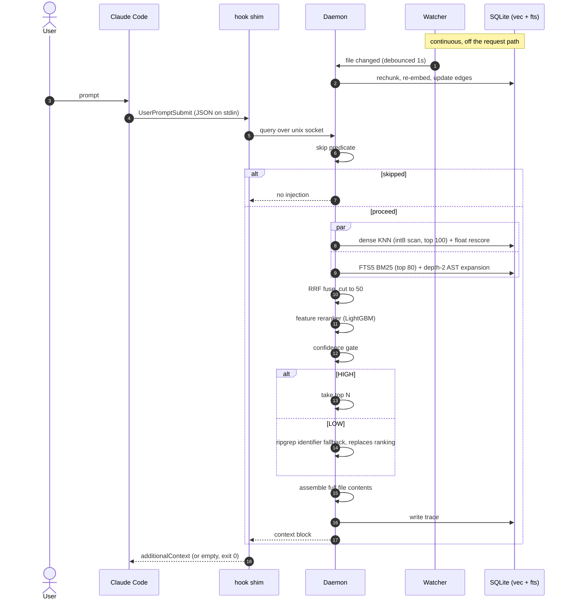

# Hybrid Retrieval Pipeline — Specification

Status: approved design, pre-implementation.
Supersedes: `docs/hybrid-reteival-pipeline.mmd` (stages 5-6 of that diagram are out of scope, see §2).

---

## 1. What this is

A resident local daemon plus a Claude Code `UserPromptSubmit` hook. Before each user turn, it
retrieves the files most relevant to the prompt from the current repo and injects their contents
into the model's context, so the agent starts with the right code instead of searching for it.

Everything runs locally except the model that consumes the injected context. The daemon never
calls a cloud API.

## 2. Scope

**In scope (Tier A, diagram stages 0-4):**
incremental indexing, dense retrieval, sparse retrieval, AST-boosted structural expansion,
rank fusion, learned reranking, confidence gating, deterministic grep fallback, context assembly,
tracing, evaluation.

**Out of scope:** the Writer (stage 5) and the SilentVerifier / single-hop repair (stage 6).
Claude Code is the Writer and already owns compile-error feedback. The original diagram's
`Writer` and `Verifier` participants have no implementation here.

**Non-goals:** multi-user, remote/hosted operation, cross-machine index sharing, IDE plugins
other than the Claude Code hook.

## 3. Revised flow



## 4. Decision record

Every row was chosen explicitly. Rationale is one line; alternatives considered are in the
session that produced this document.

### 4.1 Platform

| # | Decision | Rationale |
|---|---|---|
| 1 | Greenfield; archive current tree to `archive/aiconductor`, wipe `main` | Nothing in AIConductor serves retrieval |
| 2 | Python 3.12, `uv` + `pyproject.toml`, lockfile committed | ML ecosystem; `uv run` makes the hook shim a one-liner |
| 3 | CUDA on an NVIDIA dGPU; assumed ≥6GB VRAM | Enables a 0.6B embedder and future training |
| 4 | Integration surface is a Claude Code hook, not an MCP tool or HTTP API | Zero friction, fires automatically |
| 5 | `UserPromptSubmit` only | Matches stages 0-4; one trigger path to test |
| 6 | One daemon serving all repos, unix socket, autostarted by the shim on connect failure | Model loads into VRAM once |
| 7 | Hook fails open, always exit 0 | A retrieval tool must never break a session |
| 8 | Latency budget ≤3s end to end, p95 | Leaves headroom for a future reranker cascade |

### 4.2 Index

| # | Decision | Rationale |
|---|---|---|
| 9 | sqlite-vec + FTS5 in one database file | Dense and sparse update in one transaction, no skew |
| 10 | int8 quantized vectors scanned, float32 rescore of top 200 | sqlite-vec has no ANN; 4x smaller scan, near-zero recall loss |
| 11 | Index at `.retrieval/` inside each repo, gitignored | Self-cleaning, inspectable |
| 12 | Qwen3-Embedding-0.6B, 1024 dims, fp16, seq≤512, batch≤8 | Strong on code; instruction-aware. Confirmed against the actual card (GTX 1650, 3.9GB) — kept, but tuned to fit, with OOM backoff halving the batch rather than aborting |
| 12b | Embedding dimension is read from the loaded model and recorded in `meta`, not hardcoded | Swapping embedders becomes a detectable mismatch that forces a clean reindex instead of silently comparing incompatible vectors |
| 13 | Asymmetric encoding: instruction prefix on queries only, never on documents | Required by the model; silently costs recall if wrong |
| 14 | tree-sitter symbol-level chunks (function / method / class / interface) | Semantic boundaries beat fixed windows on code |
| 15 | File score = **max** over its chunks | A 3000-line file must not win on volume |
| 16 | Freshness keyed on **working-tree content hash** (xxhash3), not git hash | The agent's own edits are the highest-value files; git hashes miss them |
| 17 | Resident watcher, 1s debounce, off the request path | The hook never waits on indexing |
| 18 | Cold start: sparse + AST build synchronously (seconds), dense fills in background | Useful on prompt one without a multi-minute freeze |
| 19 | Indexer is resumable and idempotent | Very large repos; must survive being killed |

### 4.3 Retrieval

| # | Decision | Rationale |
|---|---|---|
| 20 | Query text = raw user prompt + Qwen3 query instruction prefix | No extra latency, no second model |
| 21 | Sparse = FTS5 BM25, top 80, over content + path + symbol + an identifier-split column | Zero extra dependency, in the same DB. The `ident` column is load-bearing: unicode61 treats `RotateRefreshToken` as one token, so without it the query "refresh token" cannot match the diagram's own example |
| 22 | AST boost = depth-2 import traversal from BM25 seeds | Structural signal is what beats plain grep |
| 23 | Fusion = RRF, k=60, **cut to 50** | The diagram's "top 100 of a 100-union" is a no-op; 50 halves scorer work |
| 24 | Scorer = LightGBM over ~16 cheap features, CPU | Sub-millisecond, trainable, inspectable; a 3B LoRA was never viable in a 3s budget |
| 25 | Labels from git-history mining: commit message = query, changed files = positives | Thousands of free examples; the only cold-start answer that exists |
| 26 | Gate thresholds calibrated on the eval set, not hardcoded | The diagram's 0.85/0.15 over 100 logits is unreachable in practice |
| 27 | Gate operates on top-N set quality (rank-N vs rank-N+1 margin + max score), not argmax | We ship a set of files, so the gate must judge a set |
| 28 | LOW confidence → ripgrep identifier fallback **replaces** the ranking | Deterministic and usually right for identifier-shaped prompts |

### 4.4 Output

| # | Decision | Rationale |
|---|---|---|
| 29 | Payload = **full file contents** of top N, N configurable (default 5) | Zero extra tool round-trips when retrieval is correct |
| 30 | **Uncapped** by default; `max_tokens = null` present in config | Accepted risk, see §9.1 |
| 31 | Skip predicate: short prompts, slash commands, pure questions, continuations | Every no-op firing is expensive under an uncapped payload |
| 32 | Full per-query stage trace to SQLite | Feeds eval, debugging, and future implicit-feedback labels |
| 33 | Trace retention 30 days | Bounded disk |

### 4.5 Languages

| # | Decision | Rationale |
|---|---|---|
| 34 | Pluggable `LanguageAdapter`; chunking generalizes, import resolution does not | The four resolvers are genuinely different problems |
| 35 | Build order: C# → TypeScript → Python → Go | C# is the hardest resolver; if the interface survives it, it survives anything |
| 36 | v1 = all four adapters complete | Full coverage before release |

## 5. Components

### 5.1 Hook shim (`hook/shim.py`)
Reads the `UserPromptSubmit` JSON payload on stdin, connects to the daemon socket, writes the
returned block to stdout as `additionalContext`, exits 0. Autostarts the daemon on
`ConnectionRefusedError` and returns empty on that first invocation. Hard 3s socket timeout.
No imports beyond the standard library so it starts in milliseconds.

### 5.2 Daemon (`daemon/`)
`asyncio` unix-socket server, line-delimited JSON. Holds the embedding model, one open SQLite
connection per repo (LRU, max 8), the watcher, and the loaded reranker. Requests carry
`{repo_root, prompt, session_id, transcript_path}`.

### 5.3 Indexer (`index/`)
Walk → filter (`.gitignore` + binary + size cap) → hash → diff against `files` table →
for changed files: chunk, embed, quantize, upsert vec + FTS rows, rebuild that file's edges.
Batched GPU encode, batch size auto-tuned to VRAM.

### 5.4 Language adapters (`lang/`)
```python
class LanguageAdapter(Protocol):
    exts: frozenset[str]
    def chunk(self, path: Path, src: str) -> list[Chunk]: ...
    def symbols(self, path: Path, src: str) -> list[Symbol]: ...
    def import_refs(self, path: Path, src: str) -> list[ImportRef]: ...
    def resolve(self, ref: ImportRef, tbl: SymbolTable) -> list[Path]: ...
```
**C#**: namespaces do not map to paths, so `resolve` needs a `namespace → files` table built from
declarations. Two edge kinds ship: `using` (resolved import) and `same_namespace` (C# types in one
namespace see each other with no import at all), the latter capped at a fan-out of 50 because a
namespace wider than that is a grab-bag, not a signal. `.csproj` `ProjectReference` edges and
partial-class merging are **not implemented** — deferred until the eval shows they matter.
**TypeScript**: `tsconfig` `paths` + relative specifiers + `package.json` entrypoints.
**Python**: package-relative + `sys.path` roots; dynamic imports are accepted misses.
**Go**: module path + package directory, mechanical.

### 5.5 Reranker features
`dense_score`, `dense_rank`, `bm25_score`, `bm25_rank`, `rrf_score`, `n_matching_chunks`,
`ast_hop_distance`, `ast_in_degree`, `path_token_overlap`, `symbol_exact_match`, `file_tokens`,
`git_days_since_touch`, `git_churn_90d`, `git_cochange_with_recent`, `is_test`, `is_generated`.

Trained with LightGBM `lambdarank` on git-mined groups. Model artifact versioned alongside the
schema; a mismatch forces a retrain rather than silently scoring garbage.

## 6. Data model

```sql
meta(key TEXT PRIMARY KEY, value TEXT)              -- schema_version, embedder_id, model_version
files(path TEXT PRIMARY KEY, content_hash TEXT, lang TEXT, size_bytes INT,
      mtime REAL, indexed_at REAL, dense_ready INT)
chunks(id INTEGER PRIMARY KEY, path TEXT, symbol TEXT, kind TEXT,
       start_line INT, end_line INT, token_count INT)
chunk_vectors(chunk_id INTEGER PRIMARY KEY, vec BLOB)          -- float32, for rescore
vec_chunks USING vec0(chunk_id INTEGER PRIMARY KEY, embedding INT8[1024], +path TEXT)
fts_chunks USING fts5(chunk_id UNINDEXED, path, symbol, content)
edges(src TEXT, dst TEXT, kind TEXT, PRIMARY KEY(src, dst, kind))
symbols(name TEXT, path TEXT, kind TEXT)
traces(id INTEGER PRIMARY KEY, ts REAL, prompt TEXT, skipped INT, decision TEXT,
       latency_ms REAL, stages JSON, selected JSON, injected_tokens INT)
feedback(trace_id INT, read_paths JSON, edited_paths JSON, observed_at REAL)
```
Embeddings are L2-normalized, so int8 storage is `round(v * 127)` with no per-vector scale.

## 7. Configuration

`~/.config/hybrid-retrieval/config.toml`, overridable per repo at `.retrieval/config.toml`.

```toml
top_n = 5
max_tokens = null            # uncapped by default (decision 30)
socket = "~/.cache/hybrid-retrieval/daemon.sock"
latency_budget_ms = 3000

[retrieval]
dense_k = 100
sparse_k = 80
fuse_to = 50
rrf_k = 60
ast_depth = 2
rescore_k = 200

[gate]
mode = "calibrated"          # thresholds loaded from the trained model artifact

[skip]
min_prompt_chars = 25
patterns = ["^/", "^(yes|ok|go on|continue|run it)\\b"]

[index]
debounce_ms = 1000
max_file_bytes = 1_048_576

[embed]
enabled = true
model_id = "Qwen/Qwen3-Embedding-0.6B"
device = null              # cuda when available, else cpu
max_seq_length = 512       # sized for a 4GB card
batch_size = 8
files_per_batch = 16
backfill_interval_s = 5.0
trust_remote_code = false  # JinaBERT and friends need this
min_chunk_tokens = 15      # dense pass only; see below
```

**`min_chunk_tokens` is a dense-layer filter, not an indexing filter.** Chunks below the threshold
are skipped by the embedding pass but stay in FTS5, so an exact identifier search still finds
them. Measured on Polly at threshold 15: 11% of chunks skipped (713 of 6467), and 12 of 798 files
(1.5%) end up with no dense representation at all — all of them marker interfaces, empty structs
and single-member enums (`VoidResult.cs`, `IsExternalInit.cs`, `HedgedTaskType.cs`) that BM25
still retrieves by name. The skew is entirely in the expected places: 56% of property
declarations and 34% of class headers are trivial, against 2% of methods.

## 8. Failure policy

Every failure path ends in "inject nothing, exit 0". Specifically: daemon unreachable, socket
timeout, model not loaded, repo not indexed, DB locked, adapter crash on a malformed file,
reranker version mismatch. Errors go to the daemon log and the trace table, never to stdout.

## 9. Accepted risks

1. **Uncapped full-file injection.** Five large C# files can prepend 40k+ tokens to every turn.
   `max_tokens` exists in config, defaulted off. §Benchmark H1 is the test of whether this holds.
2. **v1 spans four resolvers before release.** Mitigation: run the offline eval after the C#
   adapter so ranking quality is known early rather than at the end.
3. **LOW → grep returns nothing useful for conceptual prompts.** This will look broken and be
   working as designed. Traces will show it.
4. **Train/serve gap in labels.** Commit messages are terse, past-tense, pronoun-free; prompts
   are not. Mitigated later by implicit-feedback retraining from the `feedback` table.
5. ~~**VRAM unconfirmed.**~~ Resolved: GTX 1650, 3.90GB. Decision 12 kept with tuned settings.
6. **Dense index build time is the new scale risk.** Measured 3.5 chunks/s: ~31 min for an
   800-file repo, ~6 hours for 10k files. Sparse retrieval is unaffected and available
   immediately, so this degrades quality-on-day-one rather than breaking anything — but it does
   not fit the "small to very large" repo scale the design targets. Options if it bites:
   jina-embeddings-v2-base-code (137M, ~5x faster), or embedding only the top-scoring chunk per
   symbol instead of every chunk.

## 10. Milestones

| M | Deliverable | Exit criterion | Status |
|---|---|---|---|
| M0 | Archive + wipe, project skeleton, config, CI | `uv run` green, empty test suite passes | **done** |
| M1 | Indexer + C# adapter + SQLite schema + watcher | Full index of a real C# repo, incremental update under 1s | **done** — 798-file repo (Polly) indexed in 3.1s / 6467 chunks / 15014 edges; scoped incremental update 12ms |
| M2 | Dense + sparse + RRF + assembly + hook shim | End-to-end injection working in a live session | **done** — daemon + shim inject 5 files in 472ms warm on Polly; sparse-only path 14.7ms; embedder loads in 8.7s |
| M3 | Git-history label miner + LightGBM reranker + gate calibration + offline eval | Beats a ripgrep baseline on recall@5 | **built, exit criterion NOT met** — see §10c |
| M4 | Tracing, CLI inspector, ripgrep fallback, skip rules | Benchmark Tier 1 fully automated in CI | **done** — see §10g |
| M5 | TypeScript, Python, Go adapters | v1: all four, benchmark Tier 2 report published | adapters **done** (§10h); Tier 2 **not run** |

## 10a. Facts learned by running it

Recorded because each one contradicts a reasonable assumption:

- **sqlite-vec loads fine under Nix Python.** The extension-loading risk in §5 is closed. But a
  bare BLOB parameter is read as **float32** — every int8 read and write must wrap it in
  `vec_int8(?)`, including the `MATCH` side of a KNN query.
- **The tree-sitter grammar key is `csharp`, not `c_sharp`.**
- **Block-scoped namespaces nest their types inside a `declaration_list`**, so the chunker must
  descend through that node or every type in a pre-C#10 file is invisible. File-scoped namespaces
  put types at compilation-unit level instead, so both shapes must work.
- **`sqlite3` connections are thread-bound.** The watcher's debounce callback runs on a timer
  thread and must open its own connection; WAL makes the concurrent reader/writer safe.
- **Timer threads swallow exceptions**, so a failing index batch disappears silently unless
  `_fire` catches and logs.
- **`vec0` virtual tables do not implement UPSERT.** Re-embedding a chunk must DELETE then INSERT;
  `ON CONFLICT DO UPDATE` fails at runtime, not at prepare time, so it only shows up mid-index.
- **FTS5's `bm25()` cannot appear inside an aggregate**, and wrapping it in a subquery does not
  help because SQLite flattens the subquery back into the aggregate. The max-per-file rollup has
  to happen in Python over a plain ranked query.
- **Nix's Python cannot load PyPI torch wheels** (`libstdc++.so.6` is absent from its loader
  path). The project runs on a uv-managed CPython instead. CUDA 13 wheels do work on Turing
  (sm_75) despite the version gap.
- **The GPU is a GTX 1650, 3.90GB total.** This is the answer to the open VRAM question and the
  trigger condition for §9 risk 5, resolved in favour of keeping Qwen3-0.6B with tuned settings.
- **Qwen3-0.6B embeds at 3.5 chunks/s on this card** (measured, 60s sample): ~31 minutes for
  Polly's 798 files / 6467 chunks, which extrapolates to ~6 hours for a 10k-file repo. See §9
  risk 6, and §10b for the model comparison.
- **`jinaai/jina-embeddings-v2-base-code` cannot be loaded at all.** Its `trust_remote_code`
  module imports `transformers.pytorch_utils.find_pruneable_heads_and_indices`, which modern
  transformers removed. Any model relying on remote code is a standing version-coupling risk.
- **Bigger batches are slower on a 4GB card.** gte-modernbert took 25.8s at batch 8 and 48.8s at
  batch 32 for the identical chunk set. The OOM-backoff path pays a full failed forward pass
  before halving, so oversized batches cost more than they save. Batch 8 stays the default.
- **The small-chunk filter is nearly worthless for speed.** It removes 11% of chunks but only 4%
  of wall time, because the chunks it removes are the cheapest ones. Kept for index size and
  noise reduction, not throughput.
- **The daemon and a manual `embed` run will fight over the same index** unless a lock stops
  them; both would run every forward pass twice. An advisory `flock` on `.retrieval/embed.lock`
  makes the second one back off.
- **Model load is 8.7s**, which is the whole justification for the resident daemon: it is nearly
  3x the entire hook latency budget.

## 10b. Embedder comparison (measured)

`scripts/bench_embedders.py`, GTX 1650, identical 80-file / 271-chunk subset of Polly, dense
state reset between runs. Model load time excluded from wall time.

| model | params | dim | batch | chunks | wall | vs Qwen3 |
|---|---|---|---|---|---|---|
| Qwen3-Embedding-0.6B | 600M | 1024 | 8 | 329 (no filter) | 94.0s | 1.00x |
| Qwen3-Embedding-0.6B | 600M | 1024 | 8 | 271 | 90.0s | 1.04x |
| gte-modernbert-base | 149M | 768 | 8 | 271 | **25.8s** | **3.49x** |
| gte-modernbert-base | 149M | 768 | 32 | 271 | 48.8s | 1.84x |
| bge-small-en-v1.5 | 33M | 384 | 32 | 271 | **11.6s** | **7.76x** |

Anchored to the in-situ full-repo Qwen3 measurement (~31 min for 6467 chunks), the relative
speedups give roughly: **Qwen3 ~30 min, gte-modernbert ~8.5 min, bge-small ~4 min.** Extrapolating
from the subset directly is unreliable — the first 80 files by path average 4.1 chunks against the
repo's 8.1 — so only the relative column should be trusted.

Retrieval **quality** across these models is unmeasured and stays that way until the Tier 1 eval
lands in M3. Switching on speed alone trades a measured win for an unmeasured loss.

## 10c. M3 results, and the ceiling problem

Trained on Polly, 2920 commits, 150 newest held out, **dense retrieval off**.

Label mining is heavily lossy and that is mostly correct behaviour: 2920 commits reduce to 249
eligible (merges, bulk changes and sub-three-word subjects are dropped), then to 173 usable for
training after commits whose files are not in the index are removed.

**Reranker vs the fused order (holdout, 60 queries):**

| metric | fused | reranked | delta |
|---|---|---|---|
| recall@1 | 0.237 | 0.205 | -0.033 |
| recall@5 | 0.501 | 0.539 | +0.038 |
| hit@5 | 0.667 | 0.750 | +0.083 |
| nDCG@10 | 0.516 | 0.506 | -0.010 |

**Tier 1 arms (150 holdout queries, sparse only):**

| arm | recall@5 | hit@5 | MRR | ms/query |
|---|---|---|---|---|
| B0 ripgrep | 0.207 | 0.287 | 0.235 | 39 |
| B1 BM25 only | 0.197 | 0.267 | 0.223 | 2 |
| B4 RRF + AST | 0.200 | 0.267 | 0.223 | 7 |
| B5 full pipeline | 0.215 | 0.300 | 0.225 | 3 |

**With dense retrieval fully built** (gte-modernbert, all 798 files, 5754 chunks), same 150
queries:

| arm | recall@5 | hit@5 | MRR | nDCG@10 |
|---|---|---|---|---|
| B0 ripgrep | 0.207 | 0.287 | 0.235 | 0.227 |
| B1 BM25 only | 0.197 | 0.267 | 0.223 | 0.205 |
| B2 **dense only** | **0.153** | 0.240 | 0.167 | 0.145 |
| B3 RRF, no AST | 0.196 | 0.280 | 0.202 | 0.187 |
| B4 RRF + AST | 0.196 | 0.280 | 0.199 | 0.184 |
| B5 full pipeline | 0.214 | 0.313 | 0.238 | 0.208 |

**B5 - B0 = +0.7pp against a +15pp threshold: kill criterion K3 fires.** Component by component:

* **Dense retrieval is the worst arm**, below plain BM25 on every metric, and it costs 66ms per
  query plus 13 minutes of indexing.
* **Fusion adds nothing**: B3 and B4 land on BM25's number. Dense dilutes rather than complements.
* **AST expansion adds nothing measurable**: B4 equals B3 on recall@5 and is slightly worse deeper
  in the ranking. The four-resolver plan (decision 35) is so far unjustified.
* **The reranker is the only component that earns its place**: +1.8pp recall@5 and +3.3pp hit@5
  over the candidates it is given.
* **Ripgrep beats every arm except the full pipeline.**

**Known bias, pre-registered in BENCHMARK.md section 5.** Commit subjects are a poor proxy for
prompts: terse, past-tense, and frequently naming the component whose name is literally in the
file path. That systematically favours lexical arms and penalises semantic ones, so this eval is
biased toward B0 and B1. It is still the only evidence available, and it does not support the
dense half of the design.

**The real finding is the retrieval ceiling: 39.9% on holdout.** That is the share of gold files
that appear anywhere in the 50-candidate set, so it is a hard upper bound on any reranker. Ranking
is not the bottleneck; candidate generation is. Two implications:

* Reranking effort has a low ceiling until recall improves. The +8.3pp on hit@5 is roughly what is
  available to win by reordering.
* Chasing a better scorer before raising the ceiling optimises the wrong stage — precisely the
  trap the diagram's 3B LoRA scorer represented.

## 10d. Session-history labels reverse the M3 verdict

Decision 25 chose git history for labels and flagged the train/serve gap as risk 4: commit
subjects are terse and past-tense, prompts are neither. That risk turned out to dominate
everything.

**New label source.** `sessions.py` mines `~/.claude/projects/*.jsonl`: each typed prompt becomes
a query, and the files Claude opened before the next prompt become the gold set. Reads and edits
are recorded separately, because a file read and discarded is exactly what the pipeline should not
pay to inject. Yield: **479 usable prompts across 7 repos**, 395 of which edited something, against
249 eligible commits from Polly's entire 2920-commit history.

**The ceiling problem was mostly an artefact of the labels.** Retrieval ceiling by repo, on session
prompts: 98.2%, 92.8%, 91.8%, 90.5%, 76.3%, 60.3% — against 38-40% on commit subjects. Candidate
generation was never as broken as §10c concluded; the queries were.

**Tier 1 on real prompts** (`bench/tier1_sessions.py`, 69 held-out prompts, dense off):

| arm | recall@1 | recall@5 | hit@5 | MRR |
|---|---|---|---|---|
| B0 ripgrep | 0.258 | 0.401 | 0.696 | 0.593 |
| B1 BM25 only | 0.175 | 0.460 | 0.783 | 0.559 |
| B4 RRF + AST | 0.175 | 0.460 | 0.783 | 0.559 |
| B5 full pipeline | **0.374** | **0.572** | **0.899** | **0.794** |

**B5 - B0 = +17.1pp, clearing the +15pp K3 threshold.** On the queries the tool actually serves,
the ranker earns its place: the right file is in the top five for 90% of real prompts.

**Split integrity.** Training pools every repo and holds out the globally newest 20%. The first
version of this benchmark split the newest 20% *per repo*, which silently fed the ranker's own
training data back to it. Fixing it moved the result from +15.6pp to +17.1pp, so the leak was not
what produced the win.

**What this does not show.**

* 69 held-out queries is a small sample.
* The repos are small (27 to 142 indexed files) and sketch-learn alone contributes 32 queries.
  Polly has 798 files, where retrieval is much harder. The cross-repo test is honest about this:
  the session-trained ranker applied to Polly scored *below* no ranker at all — though that test
  asks a prompt-trained model to answer commit-message queries, which is the same mismatch in
  reverse.
* **AST expansion still contributes exactly nothing**: B4 equals B1 to three decimals here, as it
  did on Polly. Decision 22 and the four-resolver plan remain unjustified by any measurement.
* Dense retrieval was off for this run and remains unmeasured on prompt queries.

**Model storage.** A ranker trained from sessions is pooled across repos and written to the config
directory; `Ranker.load` prefers a repo-local model and falls back to the global one.

## 10e. Widening the index made the numbers worse, and that is the honest number

The indexer covered only `.cs/.ts/.js/.py/.go`, so a dotfiles repo had 27 of its 107 files
indexed. Shell, lua, toml and markdown are now indexed too (window-chunked via the fallback
adapter, no symbols or edges).

**Coverage went up and scores went down.** Training examples rose from 154 to 225 (+46%), and the
pipeline's edge over ripgrep on held-out prompts fell from **+17.1pp to +11.5pp**. The earlier
figure was flattered by an index that quietly excluded the hard cases. Every arm dropped, so the
task genuinely got harder rather than the pipeline getting worse.

**A structural bug found by diagnosing the drop.** Fallback-chunked files set `symbol = path`, and
the FTS `symbol` column is weighted 3.0 on top of `path` at 2.0. Every file without a real symbol
— every doc, script and config — had its path indexed twice at a combined weight of 5.0, against
2.0 for code. Measured effect: markdown took 117 of 395 top-5 slots while only 61 were ever
needed, a 2.6x over-injection that matches the 2.5x weighting bias almost exactly. The symbol is
now the file stem.

**Language category features.** `is_doc`, `is_config` and `is_script` were added because a single
"matches the dominant language" flag cannot express that prose lexically matches almost any
prompt. This turned the reranker's holdout deltas from mixed to uniformly positive.

**Combined effect on the prompt benchmark** (79 held-out prompts, dense off):

| stage | B5 recall@5 | B5 hit@5 | vs ripgrep |
|---|---|---|---|
| narrow index (code only) | 0.572 | 0.899 | +17.1pp |
| wide index, no fixes | 0.461 | 0.797 | +9.4pp |
| plus language features | 0.468 | 0.823 | +10.1pp |
| plus symbol-weight fix | **0.482** | **0.873** | **+11.5pp** |

**Precision is the number to worry about now.** Only **32.7%** of injected top-5 slots are files
that were actually needed. Under decision 30 (uncapped full file contents) roughly two thirds of
every injection is waste, which is exactly the quantity BENCHMARK.md section 2 identifies as
deciding whether the design pays for itself. Markdown is still injected 107 times against 61
needed, and shell 32 against 19.

## 10f. Multiple agent sources

`sessions/` is now a package with one adapter per coding agent, because the label source should
not be tied to whichever agent happens to be installed. A company laptop running Copilot produces
the same `SessionExample` as a personal machine running Claude Code.

| source | location | shape | verified |
|---|---|---|---|
| `claude-code` | `~/.claude/projects/**/*.jsonl` | `tool_use` blocks, `file_path` | yes |
| `pi` | `~/.pi/agent/sessions/**/*.jsonl` | `toolCall` blocks, `arguments.path`, cwd on the session header | yes |
| `copilot-cli` | `~/.copilot/session-store.db` | SQLite: `sessions` / `turns` / `session_files` | yes |
| `copilot-chat` | VS Code `workspaceStorage/*/chatSessions/*.json` | walks for `fsPath` and `file://` URIs | **no** |

Notes that matter per source:

* **Copilot CLI is the best-shaped source of the four.** It records `session_files.turn_index`, so
  a file is tied to the turn that touched it and no forward scanning through a transcript is
  needed. `tool_name` distinguishes reads from writes.
* **Copilot Chat is unverified.** The directories exist on this machine but hold zero sessions, so
  the parser has never seen real data. It is written defensively — walking each request for
  anything path-shaped rather than assuming a schema — and it can only record reads, because VS
  Code stores *references* attached to a turn rather than tool calls.
* **A source that raises is skipped, never fatal.** These are third-party on-disk formats that
  change without notice.

**Yield on this machine:** claude-code 481, pi 2, copilot-cli 0, copilot-chat 0.

**Why pi yields almost nothing, and it is not the parser.** 113 user messages become 68 typed
prompts, 25 of which made file tool calls, and only 2 survive. The rest are dropped because the
repo they ran in no longer exists at that path: `/home/mohan/REPO/LocalScribe`,
`/home/mohan/REPO/llama.cpp` and `/home/mohan/REPO/pipeline_worker` have since moved to an external
drive. Session labels decay when repos move, which git history does not. A basename-matching
remap would recover them and is not implemented.

## 10g. M4, and the 103,000-token prompt

Shipped: per-query tracing to SQLite with 30-day pruning, a `trace` CLI inspector, the ripgrep
LOW-confidence fallback, content-based skip rules, a `stop` command, and a Tier 1 regression gate
that runs in CI.

**The skip rule does not use prompt length.** The original `min_prompt_chars = 25` skipped "rotate
the refresh token" (24 characters) and would skip "fix JWT refresh bug" (19). Length is a poor
proxy for whether a request is answerable: the rule now counts usable query terms after stopword
removal, with the character limit reduced to a floor for degenerate input. Rules are evaluated
patterns-first so the trace names the real cause — "/clear" is a slash command, not a short string.

**The fallback is ripgrep and only ripgrep.** `rg` honours .gitignore and skips binaries; POSIX
grep does neither, so substituting it would silently change which files are reachable. It is the
same function the benchmark uses as arm B0, deliberately: the thing the pipeline falls back to and
the thing it must beat should not be two implementations.

**Tier 1 in CI** runs the arm set over a synthetic repo with synthetic commits
(`tests/test_tier1_ci.py`). It is a regression gate on the harness, not a quality benchmark — the
absolute numbers are meaningless, but mining, retrieval, features and metrics are proven to still
work end to end and to beat a deliberately bad ordering. Real quality numbers still come from
`bench/tier1_sessions.py` on a machine with session history.

**Three bugs the tracing immediately exposed**, none of which were visible from the outside:

1. **One daemon, many repos, one embedder.** The daemon loads a model from the *global* config but
   each repo records the model its index was built with. Querying a 768-dimension index with a
   1024-dimension vector is a hard SQL error that failed the entire request. `dense_is_ready` now
   verifies the loaded model matches the index and skips dense instead.
2. **A stale repo-local ranker shadowed a valid global one.** `Ranker.load` raised on a feature-set
   mismatch instead of falling through, leaving the repo with no ranker at all. Any unusable model
   is now skipped with a warning.
3. **The kill/restart gap.** There was a `shutdown` op in the protocol and no way to invoke it, so
   a daemon holding old code kept serving after every change. `hybrid-retrieval stop` closes that.
4. **A clean stop exited non-zero.** `_shutdown_soon` called `loop.stop()` from inside
   `asyncio.run`, so `run_until_complete` raised "Event loop stopped before Future completed" and
   the daemon died with a traceback and exit code 1 on every deliberate shutdown — which any
   supervisor would read as a crash and restart-loop. `serve_forever` now waits on an
   `asyncio.Event` instead; the socket server accepts from the moment `start_unix_server` returns,
   so nothing is lost by not calling `Server.serve_forever`.

**The measured payload cost.** With everything working — ranker loaded, gate HIGH, correct
subject matter — the prompt "why does the circuit breaker stay open after a manual reset" injected
**103,344 tokens**. The five selected files are all correct in topic and all enormous
(`CircuitBreakerSpecs.cs` and friends). This is decision 30 realised: even a perfect ranker
injects 100k tokens when the right files are large. Precision is not the only lever; file size is.
`max_tokens` exists and is still null.

## 10h. M5: four adapters, and the case for deleting the AST boost

All four language adapters now exist with real chunking, symbols and import resolution.

| language | container gotcha | resolution |
|---|---|---|
| C# | block namespaces nest types in `declaration_list` | namespace declaration table |
| TypeScript | every export wraps in `export_statement` | relative specifiers, extension and `index.*` candidates; bare specifiers are packages, not files |
| Python | `decorated_definition` wraps decorated classes and functions | leading-dot counting for relative, source roots for absolute |
| Go | methods sit at file scope, not inside their type | strip the module prefix, resolve to a package *directory* |

Re-indexing the seven session repos: chunk counts rose 4-7x (pipeline_worker 160 to 1218) and
import graphs appeared where there were none (0 to 460 edges).

**Symbol chunking makes the lexical baselines worse.** B1's hit@5 fell from 0.747 to 0.646. This is
a direct consequence of decision 15 (max-per-file rollup): a whole-file chunk matches every query
term at once, while symbol chunks split a multi-term query across several chunks and only the best
one counts. Finer chunks are not automatically better under a max rollup.

**The reranker more than compensates**, and its contribution grew sharply now that it has symbols
to work with: its holdout hit@5 delta went from +5.4pp to **+23.2pp**.

**AST expansion should be removed.** Measured three times now, and this time with real import
graphs rather than an empty edge table:

| configuration | B5 recall@5 | B5 hit@5 | vs ripgrep |
|---|---|---|---|
| `ast_depth = 2` (decision 22) | 0.467 | 0.861 | +11.3pp |
| `ast_depth = 0` | **0.496** | **0.899** | **+14.1pp** |

Depth-2 expansion is uniformly neutral-to-negative: it dilutes the candidate set with structural
neighbours that are related but not wanted. Note what this does *not* say — the import graph is
still worth building, because `ast_in_degree` and `ast_out_degree` remain reranker features and
the symbol tables feed `symbol_exact_match`. It is specifically the retrieval-time *expansion*
that costs more than it returns. The default is unchanged pending a decision, since decision 22
was made deliberately.

## 10i. Tier 2 pilot: the pipeline costs 1.5 to 1.9x more, and K1 fires

3 tasks x 2 arms x 2 repetitions on Polly, real headless Claude Code sessions
(`bench/tier2_runner.py`). Small, and the direction is not ambiguous.

| metric | baseline | treatment | ratio |
|---|---|---|---|
| input-token-equivalents | 48,942 | 91,255 | **1.86x** |
| total tokens | 191,266 | 292,698 | 1.53x |
| turns | 9 | 13 | 1.44x |
| discovery calls | 1 | 2 | **2.00x** |
| wall seconds | 26 | 29 | 1.11x |
| success rate | 83% | 100% | — |

**Kill criterion K1 fires.** H1 predicted a ratio at or below 0.70; the measured ratio is 1.86 in
the opposite direction. Injecting context made the agent do *more* discovery, not less.

**The mechanism, and it is not what the cost model assumed.** Claude Code caps hook output at
roughly 40KB. Above that it writes the payload to a file and inlines a `<persisted-output>`
pointer. Every treatment run in this pilot spilled. So the model never received the context
inline — it received a path, and then spent extra turns reading it. An oversized injection is not
merely expensive, it is worse than injecting nothing.

**Capping did not fix it, because the cap cannot bind.** Re-running with `max_tokens = 6000`
improved the ratio to 1.50x but injections still spilled at 17-23k tokens. `assemble` always
admits the first file whole (decision 30: never truncate mid-file), so a single large file defeats
any budget. **The payload unit is the problem, not the budget.** A cap can only work if oversized
files degrade to spans, which is ablation A3 and was the "hard cap, degrade to spans" option
declined in favour of the config knob.

**What the pilot does not establish.** Six runs per arm. Success went 83% to 100%, a difference of
one run, which is noise at this scale. Tasks were read-only questions on a C# repo with no dense
index and a ranker trained on unrelated Python and TypeScript repos, so this is close to the
pipeline's worst case. It is still the only end-to-end evidence that exists, and it points the
same way as the 32.7% top-5 precision measured in §10e.

**Recommended order of work, revised by this result:** payload shape before retrieval quality.
Retrieval is already good enough to put the right file in the top five for 90% of prompts (§10h);
the delivery mechanism is what loses the money.

## 11. Open items

- VRAM and per-repo file counts, still unmeasured.
- ANN escape hatch if int8 brute force exceeds budget beyond ~1M chunks (LanceDB migration).
- Whether `max_tokens` should default on after the Tier 2 ablation says so.
